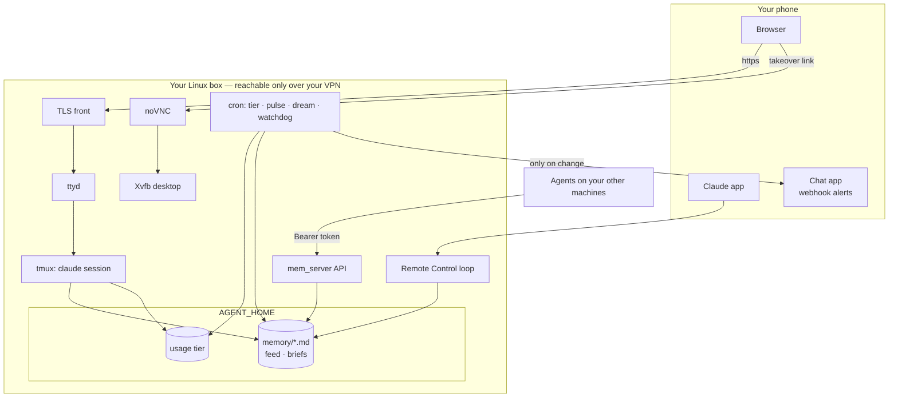

# Jupiter Autonomous Agent — always-on Claude Code agent starter kit

Stand up your own **24/7 personal agent** on a Linux box using the stock
[Claude Code](https://www.anthropic.com/claude-code) CLI and a Pro/Max subscription:
reachable from your phone, sharing one memory across every session and machine,
staying inside your plan's usage limits on its own, and checking its own work
before it tells you something is done.

It is a small set of plain scripts, hooks, skills and docs — no framework, no database
server, no cloud service of ours. Everything lives in one directory (`$AGENT_HOME`,
default `~/agent`) and is easy to read, change or delete.

## What you get

| Capability | What it does | Where |
|---|---|---|
| **Operating doctrine** | A CLAUDE.md template: act-then-report, plain summaries, safety reflex before irreversible actions, hard boundaries, token hygiene, model routing | `templates/CLAUDE.md` |
| **Shared usage tier** | Reads your *real* account 5h/7d usage from the status line, computes GREEN/YELLOW/RED for every agent, injects one line only when not GREEN, blocks subagents in RED, gates cron jobs by priority, nags bloated sessions to /compact | `bin/usage_*` |
| **Shared memory bus** | `mem` CLI + token-auth HTTP API over the same markdown store; full-text search (SQLite FTS5), activity feed, per-project briefs, nightly "dream" cleanup, session-end hook | `bin/mem*`, `bin/hook_session_end.py` |
| **Script-first pulse** | Cheap checks (site up, disk, inbox count) wake Claude only on change, with priority gating and a fail-safe | `bin/pulse_precheck.py` |
| **Phone access** | Web terminal (ttyd) behind a small TLS front, Claude Remote Control server, tmux supervisors, HTTP-probe watchdog | `always-on/` |
| **Alerts + human takeover** | Rate-limited webhook alerts; a takeover link to the agent's virtual desktop for logins/2FA/CAPTCHAs | `bin/notify`, `bin/takeover` |
| **Virtual desktop** | Xvfb + x11vnc + noVNC, and a `see` screenshot helper so the agent can look at its screen | `always-on/setup_desktop.sh`, `bin/see` |
| **Quality gate** | Fresh-context reviewer agent, `review-work` / `contemplate` / `connect-dots` skills, rubrics, and a pulse-decision eval suite | `claude/`, `evals/` |

## Architecture



More diagrams and the reasoning behind each piece: [docs/ARCHITECTURE.md](docs/ARCHITECTURE.md).

## Quickstart

```bash
git clone https://github.com/njliautaud/jupiter-autonomous-agent.git ~/src/jupiter-autonomous-agent     # anywhere except your AGENT_HOME
cd ~/src/jupiter-autonomous-agent
./install.sh                    # installs into ~/agent (override with AGENT_HOME=...)
# try it without touching ~/.claude, crontab or tmux:
AGENT_HOME=/tmp/agent-test ./install.sh --no-system
```

Then:

1. Edit `~/agent/config/agent.env` — set `BIND_ADDR` to your VPN/tailnet address if you
   want phone access, add a private webhook URL for alerts, enable the services you want.
2. Edit the **HARD BOUNDARIES** section of `~/agent/CLAUDE.md`.
3. `~/agent/always-on/start.sh` and `tmux attach -t agent`.
4. Optional: `~/agent/always-on/setup_desktop.sh` for the virtual desktop.

`install.sh` is idempotent: re-run it to upgrade. It keeps your config, memory and state,
backs up `~/.claude/settings.json` and your crontab before changing them, never
duplicates hooks or cron lines, and never uses sudo. Flags: `--no-system`, `--no-cron`,
`--no-hooks`, `--start`.

Everyday commands:

```bash
mem search "deploy"                       # before starting a task
mem write deploy-steps --desc "how we deploy" < notes.txt
mem log "rotated the backup disk"          # tell every other agent
mem feed 20                                # what everyone did lately
~/agent/bin/usage_gate.sh low "weekly digest" && claude -p "..."   # budget-aware cron job
~/agent/bin/notify --key backup "Backup finished"  # phone alert, rate-limited per topic
~/agent/bin/takeover "the bank site wants a 2FA code"
```

## Requirements

- Linux (tested on Ubuntu 22.04/24.04), bash, Python ≥ 3.8 (stdlib only), cron, tmux
- Claude Code CLI signed in with a **Pro or Max** subscription (the usage tier reads the
  subscription rate limits; Remote Control needs a claude.ai login, not an API key)
- A private network to your phone for remote access (WireGuard, Tailscale, ZeroTier, ...)
- Optional: `ttyd`, `openssl` (TLS front), `xvfb x11vnc openbox scrot` + `websockify`
  (desktop)

## Security model (short version — read [docs/SECURITY.md](docs/SECURITY.md))

- **VPN/tailnet only.** Every listener binds `127.0.0.1` by default; set it to your
  private overlay address to reach it from a phone. Never expose these ports publicly.
- **Secrets in one chmod-600 file** (`config/agent.env`), generated at install, git-ignored,
  never printed or logged. The memory API fails closed without a token.
- **Behavioural boundaries** in CLAUDE.md: hard boundaries, safety reflex before
  irreversible/outward actions, money is read-only, logins/2FA/CAPTCHAs go to a human.

## Cost model

There is nothing to pay for beyond your Claude subscription and the machine. The kit is
built around the plan's limits:

- **Idle cost ≈ 0.** Pulses are scripts; Claude is woken only when something changed.
- **Cache reads dominate usage**, so the biggest lever is short sessions — the prompt hook
  nags at 200k tokens of context. See [docs/TOKEN-HYGIENE.md](docs/TOKEN-HYGIENE.md).
- **One tier for every agent**: GREEN normal, YELLOW skip low-priority work, RED critical
  only and no subagents. Thresholds are configurable.
- **Quality costs are bounded**: one reviewer round (max two) per deliverable; the
  3-attempt `contemplate` mode only runs for hard problems in GREEN.

## Layout

```
install.sh              idempotent installer
config/                 agent.env.example, crontab.example, projects.example.json
templates/CLAUDE.md     operating doctrine template
bin/                    usage tier · memory bus · pulse · notify · takeover · see · hooks installer
always-on/              start.sh · watchdog.sh · tls_proxy.py · desktop setup · loops/
claude/                 agents/work-reviewer.md · skills/{review-work,contemplate,connect-dots}
evals/                  rubrics/ · pulse/ (scenarios + runner)
docs/                   ARCHITECTURE · SECURITY · TOKEN-HYGIENE · RESEARCH
tests/smoke.sh          offline smoke test (temp AGENT_HOME, no system changes)
```

## Testing

```bash
tests/smoke.sh                      # syntax checks + install into a temp dir + exercise hooks, gate, mem, API
evals/pulse/runner.py --subset 5    # needs the claude CLI; ~5 short model calls + judge
```

## License

MIT — see [LICENSE](LICENSE).
