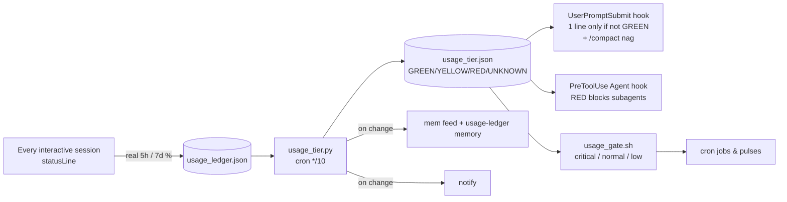
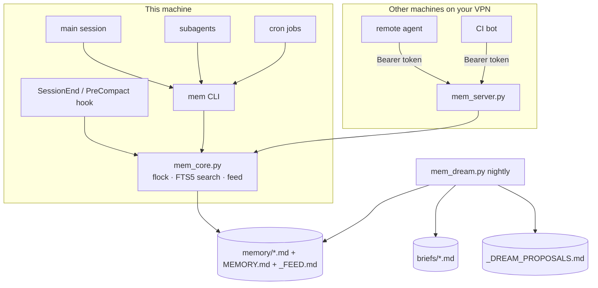
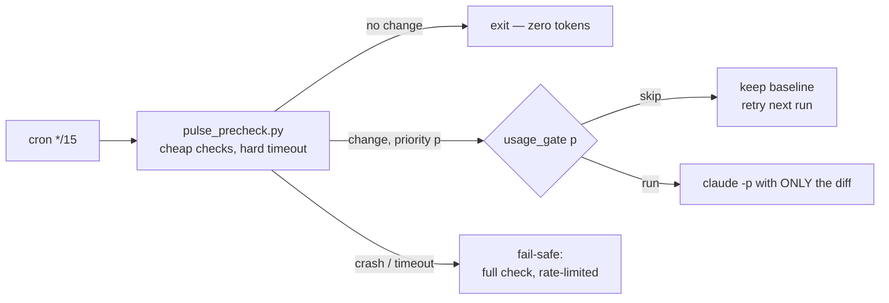
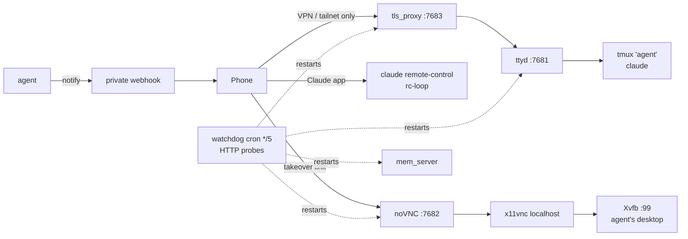

# Architecture

Everything is plain files, small Python/bash scripts, tmux and cron around the stock
Claude Code CLI. No daemon framework, no database server, no vendor lock-in.

```
$AGENT_HOME (default ~/agent)
├── CLAUDE.md            operating doctrine the agent reads every session
├── NOTES.md             live project state (the agent keeps it current)
├── ACTIONS.log          one line per irreversible/outward action
├── config/agent.env     your settings + secrets (chmod 600, never committed)
├── bin/                 usage tier, memory bus, notify/takeover/see, pulse precheck
├── always-on/           tmux supervisors, watchdog, TLS front, desktop setup
├── claude/              agent + skills (installed into ~/.claude)
├── evals/               rubrics for the reviewer, pulse decision evals
├── memory/              the shared brain (markdown + index + feed + briefs)
├── state/               runtime state (tier, ledger, tokens, certs) — never committed
└── logs/
```

## 1. Shared usage tier (one budget, many agents)



- **Sensor, not estimate.** Claude Code passes the account's real rate-limit usage to the
  status-line command. Dollar estimates from transcripts badly mis-predict subscription
  limits; the real percentage does not.
- **Quiet when fine.** The prompt hook prints nothing in GREEN, so it adds zero tokens on a
  normal day.
- **Never blocks on missing data.** No fresh reading = UNKNOWN = everything runs. A manual
  brake file (`state/TOKEN_SAVER`) forces RED when the ledger is stale.
- **Protected dirs.** `USAGE_PROTECTED_DIRS` lists directories whose sessions are never
  blocked (time-critical bots).

## 2. Shared memory bus (one brain)



- Memories are markdown with frontmatter — readable, greppable, diffable, and compatible
  with Claude Code's own auto-memory format.
- The **feed** is the anti-surprise mechanism: every write and every `mem log` lands there,
  so an agent starting work sees what others just did.
- The **index** is updated additively (one bullet upserted), never regenerated.
- **Dreaming** applies only mechanical fixes automatically; judgement calls become proposals.

## 3. Script-first pulse



## 4. Always-on access from a phone



Every service runs in its own tmux session under a restart loop (`always-on/loops/`).
`start.sh` only creates missing sessions, so it is safe from cron, `@reboot` and the
watchdog. The watchdog uses real HTTP probes (any HTTP status = alive).

## 5. Quality loop

- `work-reviewer` agent: fresh context, executes checks, scores a rubric, returns SHIP/FIX.
- `review-work` skill: pick rubric → reviewer → at most one fix round → one re-review.
- `contemplate` skill: 3 independent framings for hard problems, only when GREEN.
- `connect-dots` skill: weekly cross-project idea finder over briefs + feed.
- `evals/pulse`: scenario suite that checks the agent's judgement (silence when nothing
  changed, takeover on CAPTCHA, respect RED, never move money...). Its pass rate is a
  fitness score you can optimise the prompt against.
